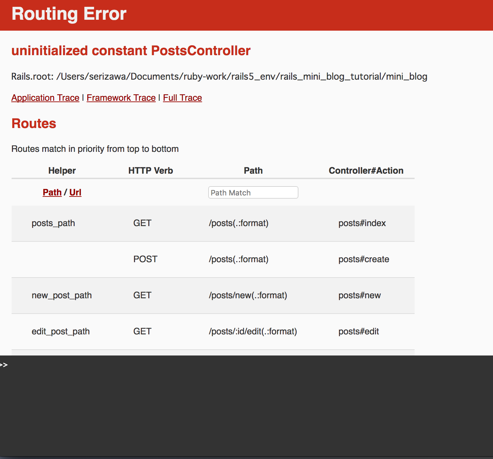
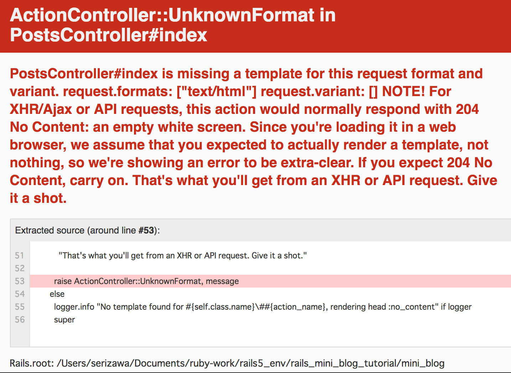

# 3 Generate PostsController

## 3.1 Define routing

You also need to define routing.  
Execute this command.

```sh
bin/rake routes
```

Then you can see like this message. 

```sh
$ bin/rake routes
Running via Spring preloader in process 86742
You don't have any routes defined!

Please add some routes in config/routes.rb.

For more information about routes, see the Rails guide: http://guides.rubyonrails.org/routing.html.
```

As Rails said, your rails application do not have any routing for now.  

Open `config/routes.rb` and edit like this.

```ruby
Rails.application.routes.draw do
  resources :posts
end
```

Now your rails application can provide some routing for `posts`.

Then execute `bin/rake routes` again.

```sh
$ bin/rake routes
Running via Spring preloader in process 13644
   Prefix Verb   URI Pattern               Controller#Action
    posts GET    /posts(.:format)          posts#index
          POST   /posts(.:format)          posts#create
 new_post GET    /posts/new(.:format)      posts#new
edit_post GET    /posts/:id/edit(.:format) posts#edit
     post GET    /posts/:id(.:format)      posts#show
          PATCH  /posts/:id(.:format)      posts#update
          PUT    /posts/:id(.:format)      posts#update
          DELETE /posts/:id(.:format)      posts#destroy
```

Then access to `http://localhost:3000/posts`.  


This looks like url you accessed is right but `PostsController` is missing.

## 3.2 Generate PostsController

You need to implement `PostsController` in order to enable to access your web application.   
Add empty file `app/controller/posts_controller.rb`

## 3.3 Add index action

Let's implement `PostsController`.  
Open `app/controllers/posts_controller.rb` and edit like this.

```ruby
class PostsController < ApplicationController
  def index
  end
end
```

This action corresponds to `GET /posts` routing.  
Access to `http://localhost:3000/posts`.



Rails shows error page. Rails shows error page when your rails application raise error.  
You can customise this error page, of course . But this tutorial do not explain how to do it.  
As you see, you need a view file for `index` action.

Add file `app/views/posts/index.html.erb` and edit like this.

```erb
<h1>Posts</h1>
```

And access to `http://localhost:3000/posts` again.  


Now you see a simple page only with a h1 attribute, not error page.
